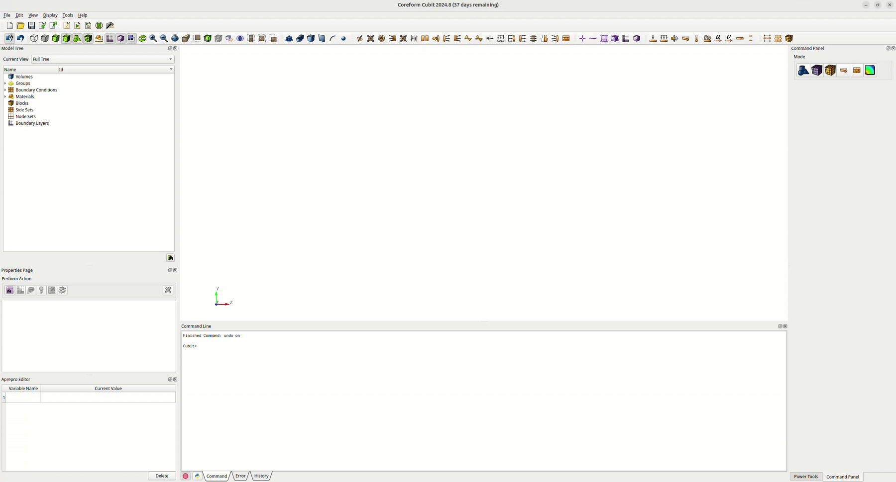

## Toolbar Installation:
  1. Clone this repository or download the tarball and unpack in the directory of your choice
  2. Run the `setup.sh` script. This ensures paths in the resulting `dagmc_toolbar.ttb` file are resolved correctly by Cubit.
  3. There should now be a `dagmc_toolbar.ttb` file in the toolbars directory.
  4. Add the toolbar using the custom toolbar editor in Cubit as shown in the animation below:

  

  **Note: If the toolbar content is relocated on your system, the `setup.sh` script should be re-run and the toolbar re-imported in Cubit.**

## Windows Users
On machines running Windows, you will only need to change step 2. Instead of running `setup.sh`, run `setup-windows.ps1`. Once you have the repository downloaded and unpacked in your preferred location, right-click `setup-windows.ps1` and then select `Run with PowerShell`. After running this script, return to step 3 in the instructions above.
